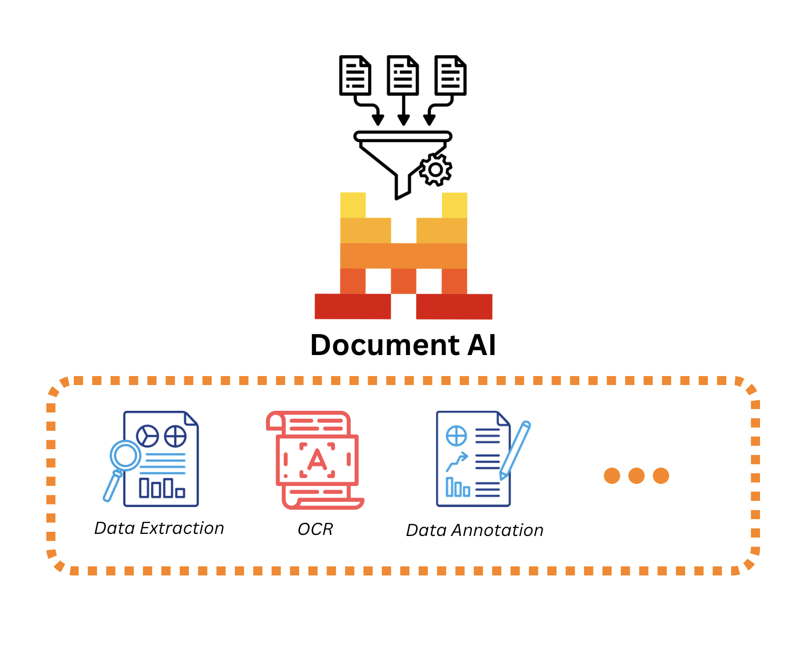

# Mistral Document AI Demo with Azure AI Foundry

This demo showcases how to use the Mistral Document AI model with Azure AI Foundry to analyze and extract content from documents, including images and structured data, using a Jupyter notebook workflow.



## Project Overview

The notebook [`Mistral Document AI with Azure AI Foundry.ipynb`](https://github.com/retkowsky/Azure-AIGEN-demos/blob/main/Mistral%20Document%20AI/Mistral%20Document%20AI%20with%20Azure%20AI%20Foundry.ipynb) demonstrates:
- How to process PDF documents with the Mistral Document AI model.
- Extraction of text, tables, and images from documents.
- Saving extracted images and structured outputs for further analysis.
- Visualizing document analysis results.

## Folder Contents

- `Mistral Document AI with Azure AI Foundry.ipynb`: Main notebook with step-by-step code and explanations.
- `document.pdf`: Example PDF document for model analysis.
- `extracted_images/`: Directory where extracted images are saved.
- `mistral-doc-structured-output.png`: Example of structured output from document analysis.
- `mistraldocai.png`: Illustration of the Mistral Document AI workflow.

## Getting Started

1. **Clone the Repository**

   ```bash
   git clone https://github.com/retkowsky/Azure-AIGEN-demos.git
   cd Azure-AIGEN-demos/Mistral Document AI
   ```

2. **Open the Notebook**

   - Launch Jupyter Notebook or VSCode and open `Mistral Document AI with Azure AI Foundry.ipynb`.

3. **Run the Demo**

   - Follow the notebook instructions to analyze `document.pdf`.
   - View the extracted images and structured output in the respective files.

## Requirements

- Python 3.x
- Jupyter Notebook
- Azure AI Foundry and access to Mistral Document AI (see notebook for details)
- Required Python packages (see notebook cells for installation instructions)

## Usage Tips

- Use your own PDF documents for analysis by replacing `document.pdf`.
- Extracted content will be saved in `extracted_images/` and as structured PNG files.

## License

This demo is for educational and demonstration purposes only.

---

For more tools and AI demos, explore the [Azure-AIGEN-demos repository](https://github.com/retkowsky/Azure-AIGEN-demos/tree/main/Mistral%20Document%20AI).