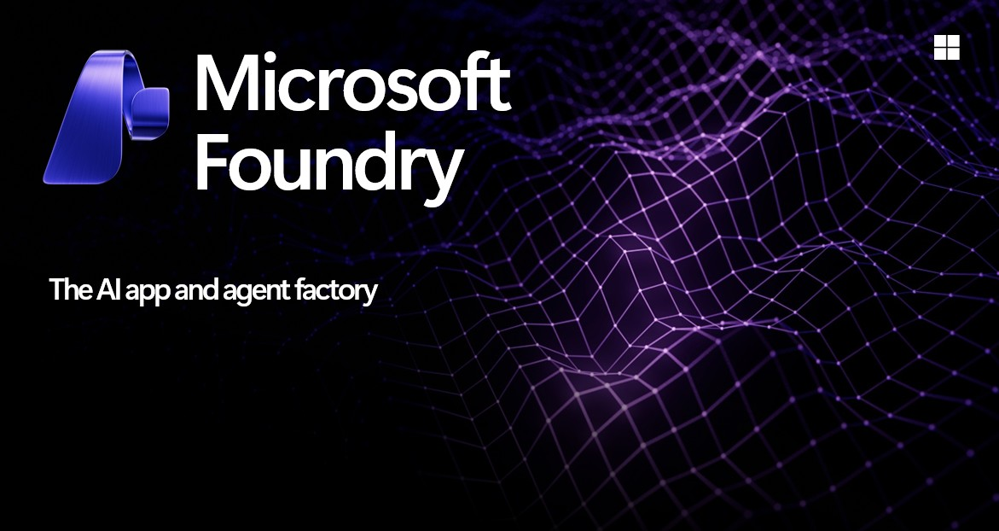
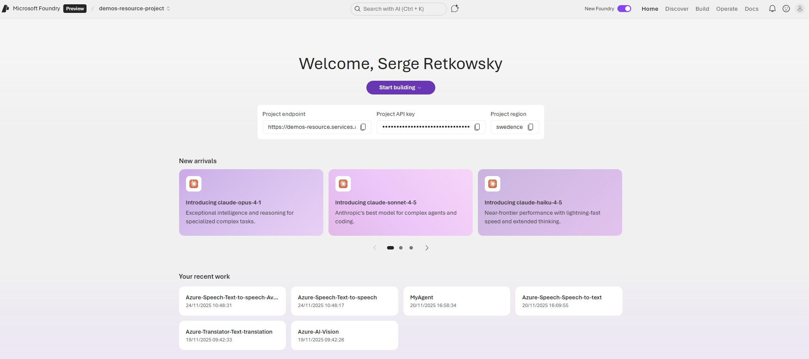
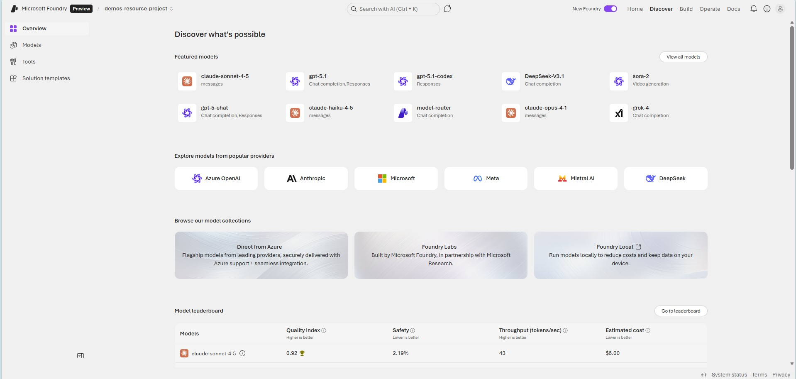

## Microsoft Foundry

 
Microsoft Foundry is a unified Azure platform-as-a-service offering for enterprise AI operations, model builders, and application development. This foundation combines production-grade infrastructure with friendly interfaces, enabling developers to focus on building applications rather than managing infrastructure.  
Microsoft Foundry unifies agents, models, and tools under a single management grouping with built-in enterprise-readiness capabilities including tracing, monitoring, evaluations, and customizable enterprise setup configurations. The platform provides streamlined management through unified Role-based access control (RBAC), networking, and policies under one Azure resource provider namespace.
  

 

 

[Microsoft Foundry portal](https://ai.azure.com/)

 

---

## Latest Content

### New content (09 September 2025)

| Item | Description | Link |
| --- | --- | --- |
| 🔥 Mistral Document AI | End‑to‑end examples of Mistral Document AI within Azure AI Foundry. | https://github.com/retkowsky/Azure-OpenAI-demos/blob/main/Mistral%20Document%20AI/Mistral%20Document%20AI%20with%20Azure%20AI%20Foundry.ipynb |
| 🔥 Flux.1 Kontext Pro – Text & Image‑to‑Image | Image editing scenarios using Flux.1 Kontext Pro with Azure AI Foundry. | https://github.com/retkowsky/Azure-OpenAI-demos/blob/main/Flux.1%20Kontext%20Pro/Image%20Edition%20with%20Flux.1%20Kontext%20Pro%20with%20Azure%20AI%20Foundry.ipynb |
| 🔥 Flux1.1 Pro – Text‑to‑Image | High‑quality text‑to‑image generation using FLUX‑1.1‑pro in Azure AI Foundry. | https://github.com/retkowsky/Azure-OpenAI-demos/blob/main/blackforestslabs/flux1.1pro/Text%20to%20image%20with%20FLUX-1.1-pro%20in%20Azure%20AI%20Foundry.ipynb |

### New content (26 August 2025)

| Item | Description | Link |
| --- | --- | --- |
| 🔥 GPT‑5 demo examples | GPT‑5 usage patterns and reference scenarios in Azure AI Foundry. | https://github.com/retkowsky/Azure-OpenAI-demos/blob/main/gpt5/Azure%20AI%20Foundry%20-%20gpt5.ipynb |

### New content (26 June 2025)

| Item | Description | Link |
| --- | --- | --- |
| 🔥 Azure AI Agent Service – Bing integration (update) | Updated Bing search integration with Azure AI Agent Service. | https://github.com/retkowsky/Azure-OpenAI-demos/blob/main/Azure%20Agent%20Service/6%20Azure%20AI%20Agent%20service%20-%20Bing%20integration.ipynb |
| 🔥 Azure AI Agent Service – Custom Bing integration | Customizable Bing‑based agents with Azure AI Agent Service. | https://github.com/retkowsky/Azure-OpenAI-demos/blob/main/Azure%20Agent%20Service/7%20Azure%20AI%20Agent%20service%20-%20Custom%20Bing%20agent.ipynb |
| 🔥 Azure AI Agent Service – Connected agents | Patterns for orchestrating multiple connected agents. | https://github.com/retkowsky/Azure-OpenAI-demos/blob/main/Azure%20Agent%20Service/8%20Azure%20AI%20Agent%20service%20-%20Connected%20agents.ipynb |
| 🔥 Grok with Azure AI Foundry | Integration scenarios using Grok models within Azure AI Foundry. | https://github.com/retkowsky/Azure-OpenAI-demos/blob/main/Grok/Grok%20with%20Azure%20AI%20Foundry.ipynb |
| 🔥 Phi‑4 reasoning with Azure AI Foundry | Advanced reasoning workflows using Phi‑4 in Azure AI Foundry. | https://github.com/retkowsky/Azure-OpenAI-demos/blob/main/phi-4%20reasoning/Phi-4%20reasoning%20with%20Azure%20AI%20Foundry.ipynb |
| 🔥 Generative AI model tracing with Azure AI Foundry | Observability and tracing for generative AI workloads. | https://github.com/retkowsky/Azure-OpenAI-demos/blob/main/tracing/Azure%20AI%20Foundry%20tracing.ipynb |
| 🔥 Agents evaluator with Azure AI Foundry | Evaluation of agentic workflows and behaviors. | https://github.com/retkowsky/Azure-OpenAI-demos/blob/main/Observability/Agents%20evaluators.ipynb |
| 🔥 Azure OpenAI evaluators with Azure AI Foundry | Built‑in evaluators for Azure OpenAI workloads. | https://github.com/retkowsky/Azure-OpenAI-demos/blob/main/Observability/Azure%20OpenAI%20evaluators.ipynb |
| 🔥 Evaluators with Azure AI Foundry | General evaluation flows for generative applications. | https://github.com/retkowsky/Azure-OpenAI-demos/blob/main/Observability/Evaluators.ipynb |
| 🔥 Custom evaluators with Azure AI Foundry | Authoring and integrating custom evaluation logic. | https://github.com/retkowsky/Azure-OpenAI-demos/blob/main/Observability/Custom%20evaluators.ipynb |
| 🔥 Retrieval evaluators with Azure AI Foundry | Quality evaluation for retrieval and RAG scenarios. | https://github.com/retkowsky/Azure-OpenAI-demos/blob/main/Observability/Retrieval%20evaluators.ipynb |
| 🔥 Risk and safety evaluators with Azure AI Foundry | Risk, safety, and compliance‑oriented evaluation flows. | https://github.com/retkowsky/Azure-OpenAI-demos/blob/main/Observability/Risk%20and%20safety%20evaluators%20with%20Azure%20AI%20Foundry.ipynb |

### New content (02 June 2025)

| Item | Description | Link |
| --- | --- | --- |
| 🔥 SORA with Azure AI Foundry | End‑to‑end SORA integration scenarios. | https://github.com/retkowsky/Azure-OpenAI-demos/blob/main/sora/SORA%20with%20Azure%20AI%20Foundry.ipynb |
| 🔥 Image‑to‑video with GPT‑4o and SORA | Image‑to‑video generation pipeline using GPT‑4o and SORA. | https://github.com/retkowsky/Azure-OpenAI-demos/blob/main/sora/Image%20to%20Video%20with%20gpt4o%20and%20SORA.ipynb |
| 🔥 Video‑to‑video with GPT‑4o and SORA | Video transformation workflows combining GPT‑4o and SORA. | https://github.com/retkowsky/Azure-OpenAI-demos/blob/main/sora/Video%20to%20Video%20with%20gpt4o%20and%20SORA.ipynb |
| 🔥 Agentic retrieval in Azure AI Search | Practical scenarios for agentic retrieval using Azure AI Search. | https://github.com/retkowsky/Azure-OpenAI-demos/blob/main/Agentic%20RAG/Introducing%20agentic%20retrieval%20in%20Azure%20AI%20Search.ipynb |
| 🔥 Model router | Routing requests dynamically across multiple models. | https://github.com/retkowsky/Azure-OpenAI-demos/blob/main/Model%20router/Model%20router.ipynb |

### New content (21 May 2025)

**AutoGen series**

| Item | Description | Link |
| --- | --- | --- |
| 🔥 AutoGen – Settings | Configuration patterns and best practices for AutoGen. | https://github.com/retkowsky/Azure-OpenAI-demos/tree/main/Autogen |
| 🔥 AutoGen – Introduction | Conceptual and architectural introduction to AutoGen. | https://github.com/retkowsky/Azure-OpenAI-demos/tree/main/Autogen |
| 🔥 AutoGen – Simple agent for financial analysis | Scenario using AutoGen agents for financial data analysis. | https://github.com/retkowsky/Azure-OpenAI-demos/tree/main/Autogen |
| 🔥 AutoGen – Azure AI Agent integration | Integration of AutoGen with Azure AI Agent Service. | https://github.com/retkowsky/Azure-OpenAI-demos/tree/main/Autogen |
| 🔥 AutoGen – Chatbot | Chat‑oriented agent implementation with AutoGen. | https://github.com/retkowsky/Azure-OpenAI-demos/tree/main/Autogen |
| 🔥 AutoGen – Enabling LLM‑powered agents to cooperate | Coordinating multiple agents collaboratively. | https://github.com/retkowsky/Azure-OpenAI-demos/tree/main/Autogen |
| 🔥 AutoGen – Multi‑agents | Multi‑agent orchestration patterns. | https://github.com/retkowsky/Azure-OpenAI-demos/tree/main/Autogen |
| 🔥 AutoGen – Multi‑agent with image generation | Multi‑agent workflows integrating image generation. | https://github.com/retkowsky/Azure-OpenAI-demos/tree/main/Autogen |
| 🔥 AutoGen – Human interaction | Human‑in‑the‑loop interactions within AutoGen flows. | https://github.com/retkowsky/Azure-OpenAI-demos/tree/main/Autogen |
| 🔥 AutoGen – Multimodal | Multimodal scenarios (text, image, etc.) with AutoGen. | https://github.com/retkowsky/Azure-OpenAI-demos/tree/main/Autogen |

### New content (30 April 2025)

**Azure AI Agent Service**

| Item | Description | Link |
| --- | --- | --- |
| 🔥 Single‑agent pattern | Basic, single‑agent implementation with Azure AI Agent Service. | https://github.com/retkowsky/Azure-OpenAI-demos/blob/main/Azure%20Agent%20Service/1%20Azure%20AI%20Agent%20service%20-%20Single%20agent.ipynb |
| 🔥 Multi‑agent orchestration | Coordination of several agents for complex workflows. | https://github.com/retkowsky/Azure-OpenAI-demos/blob/main/Azure%20Agent%20Service/2%20Azure%20AI%20Agent%20service%20-%20Many%20agents.ipynb |
| 🔥 File search (simple RAG) | Simple retrieval‑augmented generation over files. | https://github.com/retkowsky/Azure-OpenAI-demos/blob/main/Azure%20Agent%20Service/3%20Azure%20AI%20Agent%20Service%20-%20File%20Search.ipynb |
| 🔥 Code interpreter (EDA on a dataset) | Exploratory data analysis using the code interpreter tool. | https://github.com/retkowsky/Azure-OpenAI-demos/blob/main/Azure%20Agent%20Service/4%20Azure%20AI%20Agent%20service%20-%20Code%20interpreter.ipynb |
| 🔥 User function (Azure Maps Weather Services) | Function‑calling integration with Azure Maps Weather Services. | https://github.com/retkowsky/Azure-OpenAI-demos/blob/main/Azure%20Agent%20Service/5%20Azure%20AI%20Agent%20service%20-%20Function%20calling.ipynb |
| 🔥 Bing Search integration | Using Bing Search as a tool from agents. | https://github.com/retkowsky/Azure-OpenAI-demos/blob/main/Azure%20Agent%20Service/6%20Azure%20AI%20Agent%20service%20-%20Bing%20integration.ipynb |

### New content (29 April 2025)

**GPT‑image‑1 on Azure AI Foundry**

| Item | Description | Link |
| --- | --- | --- |
| 🔥 Image generation | Text‑to‑image generation scenarios with gpt‑image‑1. | https://github.com/retkowsky/Azure-OpenAI-demos/blob/main/gpt-image-1/Azure%20AI%20Foundry%20gpt-image-1%20-%20Image%20generation.ipynb |
| 🔥 Image editing | Image editing workflows based on existing images. | https://github.com/retkowsky/Azure-OpenAI-demos/blob/main/gpt-image-1/Azure%20AI%20Foundry%20gpt-image-1%20-%20Image%20edition.ipynb |
| 🔥 Image composition | Composing multiple elements into a single generated image. | https://github.com/retkowsky/Azure-OpenAI-demos/blob/main/gpt-image-1/Azure%20AI%20Foundry%20gpt-image-1%20-%20Image%20Compose.ipynb |
| 🔥 Image inpainting | Inpainting and localized image modification scenarios. | https://github.com/retkowsky/Azure-OpenAI-demos/blob/main/gpt-image-1/Azure%20AI%20Foundry%20gpt-image-1%20-%20Image%20Inpainting.ipynb |

### New content (18 April 2025)

| Item | Description | Link |
| --- | --- | --- |
| 🔥 Mistral in Azure AI Foundry | General Mistral model usage in Azure AI Foundry. | https://github.com/retkowsky/Azure-OpenAI-demos/blob/main/mistral/mistral.ipynb |
| 🔥 Mistral OCR in Azure AI Foundry | OCR‑oriented scenarios using Mistral. | https://github.com/retkowsky/Azure-OpenAI-demos/blob/main/mistral/mistral%20OCR.ipynb |
| 🔥 o1 on images | Image‑centric reasoning and analysis using the o1 model. | https://github.com/retkowsky/Azure-OpenAI-demos/blob/main/o1/o1%20on%20images.ipynb |
| 🔥 Stored completions with Azure AI Foundry | Using stored completions to optimize performance and cost. | https://github.com/retkowsky/Azure-OpenAI-demos/blob/main/Stored%20completions/Stored%20completions.ipynb |
| 🔥 Responses API examples | Core usage patterns of the Responses API. | https://github.com/retkowsky/Azure-OpenAI-demos/blob/main/Responses%20API/Responses%20API%20examples.ipynb |
| 🔥 Responses API web app | Web application example built on top of the Responses API. | https://github.com/retkowsky/Azure-OpenAI-demos/blob/main/Responses%20API/Responses%20API%20webapp.ipynb |
| 🔥 GPT‑4.1 examples | Reference workflows for GPT‑4.1 in Azure OpenAI. | https://github.com/retkowsky/Azure-OpenAI-demos/blob/main/gpt41/gpt41.ipynb |
| 🔥 gpt‑4o mini TTS | Text‑to‑speech scenarios with gpt‑4o mini. | https://github.com/retkowsky/Azure-OpenAI-demos/blob/main/gpt4ominiTTS/gpt4ominiTTS.ipynb |
| 🔥 gpt‑4o mini transcription | Speech‑to‑text and transcription examples with gpt‑4o mini. | https://github.com/retkowsky/Azure-OpenAI-demos/blob/main/gpt4ominitranscribe/gpt-4o%20mini%20transcribe.ipynb |
| 🔥 o4‑mini examples | Text‑focused o4‑mini usage scenarios. | https://github.com/retkowsky/Azure-OpenAI-demos/blob/main/o4mini/Azure%20OpenAI%20o4%20mini%20examples.ipynb |
| 🔥 o4‑mini on images | Image‑based workflows with o4‑mini. | https://github.com/retkowsky/Azure-OpenAI-demos/blob/main/o4mini/o4%20mini%20examples%20on%20images.ipynb |

### New content (14 February 2025)

| Item | Description | Link |
| --- | --- | --- |
| 🔥 o1‑mini | Compact, cost‑efficient reasoning with o1‑mini. | https://github.com/retkowsky/Azure-OpenAI-demos/blob/main/o1/Azure%20OpenAI%20o1%20mini%20examples.ipynb |
| 🔥 o3‑mini | Advanced lightweight reasoning with o3‑mini. | https://github.com/retkowsky/Azure-OpenAI-demos/blob/main/o3/Azure%20OpenAI%20o3%20mini%20examples.ipynb |
| 🔥 GPT‑4o fine‑tuning (text) | Text classification with a fine‑tuned GPT‑4o model. | https://github.com/retkowsky/Azure-OpenAI-demos/blob/main/Gpt-4o-Text-FineTuning/Text%20classification%20with%20gpt-4o%20fine%20tuned%20model.ipynb |

### New content (06 February 2025)

| Item | Description | Link |
| --- | --- | --- |
| 🔥 Azure OpenAI audio generation | Audio generation flows using GPT‑4o. | https://github.com/retkowsky/Azure-OpenAI-demos/blob/main/Azure%20OpenAI%20audio%20generation/Azure%20OpenAI%20Gpt4o%20Audio.ipynb |

### New content (23 January 2025)

| Item | Description | Link |
| --- | --- | --- |
| 🔥 Image classification with gpt‑4o | Baseline image classification with GPT‑4o. | https://github.com/retkowsky/Azure-OpenAI-demos/tree/main/gpt-4o-image-classification |
| 🔥 gpt‑4o model fine‑tuning for image classification | Fine‑tuning GPT‑4o for industrial image classification (NEU dataset). | https://github.com/retkowsky/Azure-OpenAI-demos/tree/main/gpt-4o-image-classification-finetuning |

### New content (16 January 2025)

| Item | Description | Link |
| --- | --- | --- |
| 🔥 AI audio and video podcast generator | Automated podcast production with Azure OpenAI, Azure AI Document Intelligence, and Azure AI Speech. | https://github.com/retkowsky/Azure-OpenAI-demos/tree/main/AI%20podcast%20generation |
| 🔥 GPT‑4o fine‑tuning for VQA | Visual question answering using a fine‑tuned GPT‑4o model. | https://github.com/retkowsky/Azure-OpenAI-demos/tree/main/Gpt-4o%20Fine%20tuning |

---

## Azure OpenAI Demos – Thematic Overview

| Area | Description | Link |
| --- | --- | --- |
| Azure OpenAI basics | Introductory scenarios for getting started with Azure OpenAI. | https://github.com/retkowsky/Azure-OpenAI-demos/tree/main/Basics |
| Azure OpenAI quick demos | Short, workshop‑oriented samples. | https://github.com/retkowsky/Azure-OpenAI-demos/tree/main/Azure%20Open%20AI%20quick%20demos |
| Vector embeddings | Embeddings for text, images, and audio. | https://github.com/retkowsky/Azure-OpenAI-demos/tree/main/Embeddings |
| Embeddings with pandas | Embedding patterns over pandas data frames. | https://github.com/retkowsky/Azure-OpenAI-demos/tree/main/Embeddings%20with%20Pandas |
| Azure Computer Vision and LangChain | Using Azure Computer Vision with LangChain. | https://github.com/retkowsky/Azure-OpenAI-demos/tree/main/Azure%20Computer%20Vision%20and%20Langchain |
| Azure Cognitive Search – vector search & JSON | Vector search and JSON document analysis with Azure OpenAI. | https://github.com/retkowsky/Azure-OpenAI-demos/tree/main/Azure%20Cognitive%20Search%20Vector%20Search%20Code%20Sample%20with%20Azure%20OpenAI |
| Python code analysis | Analysis of Python notebooks with LangChain and Azure Cognitive Search. | https://github.com/retkowsky/Azure-OpenAI-demos/tree/main/Code%20analysis%20with%20Langchain%20%2B%20Azure%20OpenAI%20%2B%20Azure%20Cognitive%20Search%20(vector%20store) |
| PDF document analysis | PDF analysis workflows using LangChain, Azure OpenAI, and Azure Cognitive Search. | https://github.com/retkowsky/Azure-OpenAI-demos/tree/main/Lanchain%20with%20Azure%20Open%20AI%20(PDF%20files)%20and%20Azure%20Cognitive%20Search |
| LLaMA | Introductory LLaMA‑based scenarios. | https://github.com/retkowsky/Azure-OpenAI-demos/tree/main/Llama |
| DALL‑E 2 image generation | Image generation with DALL‑E 2 in Azure OpenAI. | https://github.com/retkowsky/Azure-OpenAI-demos/tree/main/Artificial%20images%20with%20Dall-e%202 |
| Python function integration | Function calling and Python function orchestration. | https://github.com/retkowsky/Azure-OpenAI-demos/tree/main/Python%20functions%20integration |
| Video Indexer analysis | Analysing Azure Video Indexer transcripts with Azure OpenAI. | https://github.com/retkowsky/Azure-OpenAI-demos/tree/main/Video%20Indexer%20analysis |
| Email response generation | Intelligent reply generation for email content. | https://github.com/retkowsky/Azure-OpenAI-demos/tree/main/Email%20response%20generation |
| Wikification | Entity‑centric enrichment and wikification flows. | https://github.com/retkowsky/Azure-OpenAI-demos/tree/main/Wikification |
| Resume analysis | CV/resume parsing, extraction, and scoring. | https://github.com/retkowsky/Azure-OpenAI-demos/tree/main/Resume%20analysis |
| Text analytics & sentiment | Text analytics and sentiment analysis with Azure OpenAI. | https://github.com/retkowsky/Azure-OpenAI-demos/tree/main/Text%20analytics%20with%20Azure%20Open%20AI |
| Prompt Flow model invocation | Calling deployed Prompt Flow models from code. | https://github.com/retkowsky/Azure-OpenAI-demos/tree/main/PromptFlow%20model%20deployment |
| From text to emojis | Emoji‑based categorisation of text. | https://github.com/retkowsky/Azure-OpenAI-demos/tree/main/From%20text%20to%20emoji |
| Code optimization and conversion | Refactoring, optimisation, and language conversion of code. | https://github.com/retkowsky/Azure-OpenAI-demos/tree/main/Code%20Optimization%20and%20conversion |
| PowerPoint generation | Automatic PowerPoint generation with Azure OpenAI. | https://github.com/retkowsky/Azure-OpenAI-demos/tree/main/PowerPoint%20generation%20with%20Azure%20Open%20AI |
| FHIR analysis | Healthcare FHIR data analysis scenarios. | https://github.com/retkowsky/Azure-OpenAI-demos/tree/main/FHIR%20analysis |
| Utilities | Reusable utilities for Azure OpenAI projects. | https://github.com/retkowsky/Azure-OpenAI-demos/tree/main/Utilities |
| Meeting audio analysis | End‑to‑end flow for meeting audio analysis with Azure OpenAI and Azure Speech. | https://github.com/retkowsky/Azure-OpenAI-demos/tree/main/Analyse%20audio%20meeting%20notes%20with%20Azure%20Open%20AI%20and%20Azure%20Speech%20Services |

---

## Documentation

| Item | Description | Link |
| --- | --- | --- |
| Microsoft Foundry – product page | Product overview, capabilities, and pricing. | https://azure.microsoft.com/en-us/products/ai-foundry/#AI-Foundry-Hero |
| What is Microsoft Foundry? | Conceptual documentation and key architectural concepts. | https://learn.microsoft.com/en-us/azure/ai-foundry/what-is-azure-ai-foundry |

---

## Author

| Field | Details |
| --- | --- |
| Name | Serge Retkowsky |
| Created | 05 September 2023 |
| Last updated | 24 November 2025 |
| Email | serge.retkowsky@microsoft.com |
| LinkedIn | https://www.linkedin.com/in/serger/ |
| Medium publications | https://medium.com/@sergems18/ |
