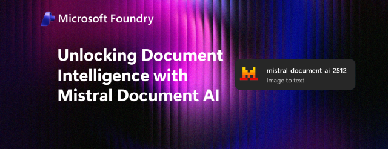

# Mistral Document AI 2512 on Microsoft Foundry

This notebook demonstrates how to use **`mistral-document-ai-2512`** deployed on **Microsoft Foundry** (Azure AI Foundry) for enterprise-grade document understanding.

## What is Mistral Document AI 2512?

**Mistral Document AI 2512** combines two powerful models into a single document-understanding pipeline:

- **mistral-ocr-2512** (OCR 3) — state-of-the-art OCR with 99%+ accuracy across 25+ languages
- **mistral-small-2506** — intelligent document understanding for structured extraction and annotation

Together they handle PDFs, scanned images, and complex layouts (multi-column, tables, mathematical formulas, headers/footers) in a single API call.

References:
- [Unlocking Document Understanding with Mistral Document AI in Microsoft Foundry](https://techcommunity.microsoft.com/blog/azure-ai-foundry-blog/unlocking-document-understanding-with-mistral-document-ai-in-microsoft-foundry/4495664)
- [Model card on Azure AI Foundry](https://ai.azure.com/explore/models/mistral-document-ai-2512/version/1/registry/azureml-mistral)

Notebook:
[`mistral_document_ai_2512_azure_foundry.ipynb`](./mistral_document_ai_2512_azure_foundry.ipynb)

---

## What you'll build

A comprehensive document-AI pipeline covering:

1. **Basic OCR** — extract text from a remote PDF URL
2. **Table extraction** — extract tables as HTML or Markdown for downstream processing
3. **Header & footer extraction** — isolate page headers and footers from the main content
4. **Local file OCR** — encode a local PDF or image to base64 and process it
5. **Image OCR** — process PNG, JPEG, and other image formats (receipts, scanned pages)
6. **Page selection** — process only specific pages from a large PDF
7. **BBox Annotations** — annotate individual images/figures with structured JSON (chart types, captions, descriptions) using a Vision LLM
8. **Document Annotations** — extract structured data (invoices, research paper metadata) from the full document according to a Pydantic schema
9. **Combined Annotations** — run BBox and Document annotations simultaneously in a single API call

---

## Prerequisites

### Azure

- An **Azure subscription**
- Access to **Microsoft Foundry** (Azure AI Foundry)
- A deployed **mistral-document-ai-2512** endpoint  

## Notebook structure

| Section | Description |
|---------|-------------|
| 1. Setup & Configuration | Load env, configure endpoint URL and model name |
| 2. Helper functions | Auth headers, base64 encoding, result display, export helpers |
| 3. Basic OCR — PDF from URL | Extract text from a remote PDF |
| 4. OCR with Table Formatting | Extract tables as HTML or Markdown |
| 5. OCR with Header & Footer Extraction | Isolate page headers and footers |
| 6. OCR on a Local PDF | Base64-encode and process a local PDF file |
| 7. OCR on an Image | Process JPEG/PNG images (receipts, scans) |
| 8. Page Selection | Process only specific pages of a PDF |
| 9. BBox Annotations | Annotate figures/images with structured JSON schema |
| 10. Document Annotations — Invoice | Extract structured invoice data with Pydantic schema |
| 11. Document Annotations — Research Paper | Extract paper metadata (title, authors, abstract) |
| 12. Combined BBox + Document Annotations | Run both annotation types in one API call |
| 13. Saved results | List all exported files |

---

## Sample documents

The [`documents/`](./documents) folder contains sample files used in the notebook:

| File | Used in section |
|------|-----------------|
| `article.pdf` | Section 6 — Local PDF OCR |
| `invoice.pdf` | Section 10 — Invoice extraction |
| `scan.jpg` | Section 7 — Image OCR |

---

## Output

Results are saved to the [`results/`](./results) folder

---

## Author

| Field | Details |
| --- | --- |
| Name | Serge Retkowsky |
| Email | serge.retkowsky@microsoft.com |
| LinkedIn | https://www.linkedin.com/in/serger/ |
| Medium publications | https://medium.com/@sergems18/ |
