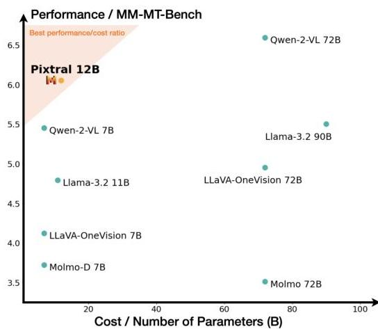

# Leveraging Unlabeled Data to Predict Out-of-Distribution Performance

Saurabh Garg
Carnegie Mellon University
sgarg2@andrew.cmu.edu
&Sivaraman Balakrishnan
Carnegie Mellon University
sbalakri@andrew.cmu.edu
&Zachary C. Lipton
Carnegie Mellon University
zlipton@andrew.cmu.edu
&Behnam Neyshabur
Google Research, Blueshift team
neyshabur@google.com
&Hanie Sedghi
Google Research, Brain team
hsedghi@google.com

###### Abstract

Real-world machine learning deployments are characterized by mismatches between the source (training) and target (test) distributions that may cause performance drops. In this work, we investigate methods for predicting the target domain accuracy using only labeled source data and unlabeled target data. We propose Average Thresholded Confidence (ATC), a practical method that learns a threshold on the model’s confidence, predicting accuracy as the fraction of unlabeled examples for which model confidence exceeds that threshold. ATC outperforms previous methods across several model architectures, types of distribution shifts (e.g., due to synthetic corruptions, dataset reproduction, or novel subpopulations), and datasets (Wilds, ImageNet, Breeds, CIFAR, and MNIST). In our experiments, ATC estimates target performance $2$–$4\times$ more accurately than prior methods. We also explore the theoretical foundations of the problem, proving that, in general, identifying the accuracy is just as hard as identifying the optimal predictor and thus, the efficacy of any method rests upon (perhaps unstated) assumptions on the nature of the shift. Finally, analyzing our method on some toy distributions, we provide insights concerning when it works.

## 1 Introduction

Machine learning models deployed in the real world typically encounter examples from previously unseen distributions. While the IID assumption enables us to evaluate models using held-out data from the source distribution (from which training data is sampled), this estimate is no longer valid in presence of a distribution shift. Moreover, under such shifts, model accuracy tends to degrade *(Szegedy et al., 2014; Recht et al., 2019; Koh et al., 2021)*. Commonly, the only data available to the practitioner are a labeled training set (source) and unlabeled deployment-time data which makes the problem more difficult. In this setting, detecting shifts in the distribution of covariates is known to be possible (but difficult) in theory *(Ramdas et al., 2015)*, and in practice *(Rabanser et al., 2018)*. However, producing an optimal predictor using only labeled source and unlabeled target data is well-known to be impossible absent further assumptions *(Ben-David et al., 2010; Lipton et al., 2018)*.

Two vital questions that remain are: (i) the precise conditions under which we can estimate a classifier’s target-domain accuracy; and (ii) which methods are most practically useful. To begin, the straightforward way to assess the performance of a model under distribution shift would be to collect labeled (target domain) examples and then to evaluate the model on that data. However, collecting fresh labeled data from the target distribution is prohibitively expensive and time-consuming, especially if the target distribution is non-stationary. Hence, instead of using labeled data, we aim to use unlabeled data from the target distribution, that is comparatively abundant, to predict model performance. Note that in this work, our focus is not to improve performance on the target but, rather, to estimate the accuracy on the target for a given classifier.

---

Published as a conference paper at ICLR 2022

Figure 1: Illustration of our proposed method ATC. Left: using source domain validation data, we identify a threshold on a score (e.g. negative entropy) computed on model confidence such that fraction of examples above the threshold matches the validation set accuracy. ATC estimates accuracy on unlabeled target data as the fraction of examples with the score above the threshold. Interestingly, this threshold yields accurate estimates on a wide set of target distributions resulting from natural and synthetic shifts. Right: Efficacy of ATC over previously proposed approaches on our testbed with a post-hoc calibrated model. To obtain errors on the same scale, we rescale all errors with Average Confidence (AC) error. Lower estimation error is better. See Table 1 for exact numbers and comparison on various types of distribution shift. See Sec. 5 for details on our testbed.

Recently, numerous methods have been proposed for this purpose (Deng &amp; Zheng, 2021; Chen et al., 2021b; Jiang et al., 2021; Deng et al., 2021; Guillory et al., 2021). These methods either require calibration on the target domain to yield consistent estimates (Jiang et al., 2021; Guillory et al., 2021) or additional labeled data from several target domains to learn a linear regression function on a distributional distance that then predicts model performance (Deng et al., 2021; Deng &amp; Zheng, 2021; Guillory et al., 2021). However, methods that require calibration on the target domain typically yield poor estimates since deep models trained and calibrated on source data are not, in general, calibrated on a (previously unseen) target domain (Ovadia et al., 2019). Besides, methods that leverage labeled data from target domains rely on the fact that unseen target domains exhibit strong linear correlation with seen target domains on the underlying distance measure and, hence, can be rendered ineffective when such target domains with labeled data are unavailable (in Sec. 5.1 we demonstrate such a failure on a real-world distribution shift problem). Therefore, throughout the paper, we assume access to labeled source data and only unlabeled data from target domain(s).

In this work, we first show that absent assumptions on the source classifier or the nature of the shift, no method of estimating accuracy will work generally (even in non-contrived settings). To estimate accuracy on target domain perfectly, we highlight that even given perfect knowledge of the labeled source distribution (i.e.,  $p_{s}(x,y)$ ) and unlabeled target distribution (i.e.,  $p_{t}(x)$ ), we need restrictions on the nature of the shift such that we can uniquely identify the target conditional  $p_{t}(y|x)$ . Thus, in general, identifying the accuracy of the classifier is as hard as identifying the optimal predictor.

Second, motivated by the superiority of methods that use maximum softmax probability (or logit) of a model for Out-Of-Distribution (OOD) detection (Hendrycks &amp; Gimpel, 2016; Hendrycks et al., 2019), we propose a simple method that leverages softmax probability to predict model performance. Our method, Average Thresholded Confidence (ATC), learns a threshold on a score (e.g., maximum confidence or negative entropy) of model confidence on validation source data and predicts target domain accuracy as the fraction of unlabeled target points that receive a score above that threshold. ATC selects a threshold on validation source data such that the fraction of source examples that receive the score above the threshold match the accuracy of those examples. Our primary contribution in ATC is the proposal of obtaining the threshold and observing its efficacy on (practical) accuracy estimation. Importantly, our work takes a step forward in positively answering the question raised in Deng &amp; Zheng (2021); Deng et al. (2021) about a practical strategy to select a threshold that enables accuracy prediction with thresholded model confidence.